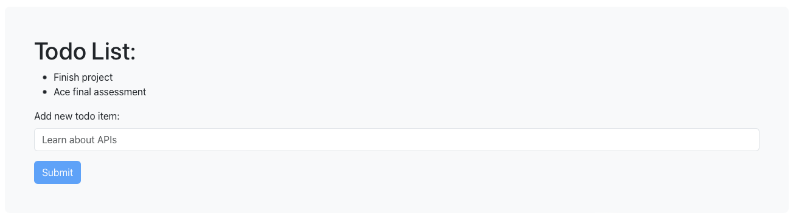

# Fullstack Example - Todo list

This is a really simple example of how you can connect your frontend and backend apps.  
Use HTTP GET request to ask for information from the backend.  
Use HTTP POST requests to send information to the backend.  
Information is sent as JSON which is nice and easy to use and understand.

The backend app will keep track of your todo list.  
Add more items to the list using the frontend.
